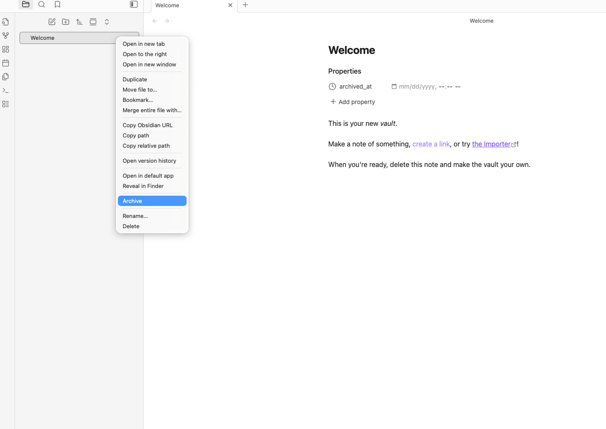

# Note Archiver

An Obsidian plugin that archives notes by hiding them from the file explorer based on a date/time file property (e.g., archived_at).

## Local Development

Make sure you have latest version of Obsidian.md (see: https://obsidian.md/) installed on your device.

### Setup

1. Clone the repo into a development vault (`{vault}/.obsidian/plugins/{your_clone}`)
2. Run `yarn dev` or `npm run dev` at the root
3. For changes, make sure to "Force Reload" the Obsidian Vault (Menu > View > Force Reload)
